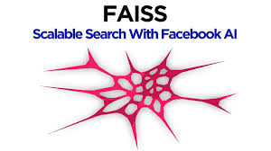

<h1 align="center">Hey there, I'm Piyush 👋</h1>
<h3 align="center">B.Tech IT · Python Developer · AI/ML Enthusiast</h3>

<i>Building intelligent systems at the intersection of security and generative AI</i>

## 🧠 About Me

- 🎓 **B.Tech Information Technology** student at MSIT, Delhi
- 🤖 Specializing in **AI/ML** and **full-stack development**
- 🔐 Built **LLM-based security systems** and **REST API-driven platforms**
- 🧪 Hands-on with **Generative AI**, **LangChain**, and **RAG pipelines**
- 💡 Always exploring the latest in **open-source AI**

## 🌐 Socials:

  
  
  
  
    
  <code>LinkedIn</code> <code>X</code> <code>Email</code> <code>Instagram</code>

## 💻 Tech Stack:

  
<b>Languages</b>

  
   
  
<code>Python</code> <code>Java</code> <code>JavaScript</code> <code>C++</code> <code>C</code> <code>SQL</code>

  
    

  
<b>AI & GenAI</b>

  
  
  
  
  
  
   
  
<code>LangChain</code> <code>LangGraph</code> <code>Pinecone</code> <code>Vector DBs</code> <code>FAISS</code> <code>RAG</code>

    

  
<b>Frontend</b>

  
   
  
<code>React</code> <code>Next.js</code> <code>HTML5</code> <code>CSS3</code>

    

  
<b>Backend & APIs</b>

  
  
   
  
<code>FastAPI</code> <code>Flask</code> <code>Convex</code>

    

  
<b>Cloud & Tools</b>

  
   
  
<code>Git</code> <code>Docker</code> <code>Google Cloud</code> <code>Firebase</code> <code>Vercel</code>

## 📊 GitHub Stats:

  

---

